<!--
  Muhammad Aneeq Uz Zaman — GitHub profile README.
  The repo must stay named exactly `Aneeq-uz-Zaman` (matching the username) so it renders
  on the profile page.

  dark.svg / light.svg are the banner; the <picture> below serves one per GitHub theme.
  Don't hand-edit the SVGs — change PROFILE in generate_banner.py and re-run it.

  stats-*.svg / langs-*.svg are built by generate_stats.py from the GitHub GraphQL API and
  refreshed weekly by .github/workflows/refresh-stats.yml. They are generated here rather
  than pulled from github-readme-stats.vercel.app, which is chronically down (503).
-->

<picture>
  <source media="(prefers-color-scheme: dark)"  srcset="./dark.svg">
  <source media="(prefers-color-scheme: light)" srcset="./light.svg">
  
</picture>

  

 

---

### 👋 About

I'm **Muhammad Aneeq Uz Zaman** — a **BS Data Science** student at **PUCIT, Lahore** who builds
full-stack products and the Python automation that feeds them. I started out automating other
people's busywork on Fiverr, and I still care about the same thing: software that removes a
manual step and keeps working after you stop watching it. **Available for freelance.**

- 🤖 &nbsp;**Automation & scraping** — Selenium · BeautifulSoup · PyAutoGUI; listings, reviews and company data out to clean Excel/CSV
- 🧩 &nbsp;**Full-stack** — Next.js · React · Node/Express · MongoDB · Tailwind
- 📊 &nbsp;**Data science** — Pandas · NumPy · Jupyter; traffic-safety and smart-city analytics
- 🎓 &nbsp;BS Data Science, **PUCIT (New Campus)** — CGPA **3.60/4.0**, class of 2028
- 💼 &nbsp;**20+ projects delivered** as a freelance Python developer — Fiverr, Aug 2023 – Nov 2024

### 🚀 Things I've built

| Project | What it does | Built with |
|---|---|---|
| **[DocPilotAI](https://github.com/Aneeq-uz-Zaman/DocPilotAI)** · [try it](https://huggingface.co/spaces/ANEEQ-UZ-ZAMAN/DocPilotAI) | RAG chatbot — upload a PDF, ask questions, get answers grounded in the document | Python · Gradio · Groq |
| **[LifePilotAI](https://github.com/Aneeq-uz-Zaman/LifePilotAI)** | Study & freelancing assistant for university students | Python · Gradio |
| **[Notes Vault](https://github.com/Aneeq-uz-Zaman/PASTEAPP)** | Notes app with email-code verification, JWT cookies and per-user scoping | Next.js · MongoDB |
| **[Maze Path Finder](https://github.com/Aneeq-uz-Zaman/path-finder)** | DFS pathfinding visualiser built to make graph theory and backtracking visible | JavaScript |
| **[Smart City Traffic Analytics](https://github.com/Aneeq-uz-Zaman/SMART-CITY-TRAFFIC-SAFETY-ANALYTICS)** | Accident data analysis — cleaning, feature work and road-safety insights | Jupyter · Pandas |
| **[Portfolio](https://github.com/Aneeq-uz-Zaman/Portfolio-website)** · [live](https://aneequzzaman.vercel.app) | The site this banner takes its colours from | React · Framer Motion · Three.js |

### 📊 GitHub

<picture>
  <source media="(prefers-color-scheme: dark)"  srcset="./stats-dark.svg">
  <source media="(prefers-color-scheme: light)" srcset="./stats-light.svg">
  
</picture>
&nbsp;
<picture>
  <source media="(prefers-color-scheme: dark)"  srcset="./langs-dark.svg">
  <source media="(prefers-color-scheme: light)" srcset="./langs-light.svg">
  
</picture>

  

<picture>
  <source media="(prefers-color-scheme: dark)"  srcset="https://streak-stats.demolab.com?user=Aneeq-uz-Zaman&hide_border=true&background=0e2331&ring=2ed3b7&fire=ff8a3d&currStreakNum=e8f1f7&currStreakLabel=2ed3b7&sideNums=e8f1f7&sideLabels=9db2c2&dates=6f8797">
  <source media="(prefers-color-scheme: light)" srcset="https://streak-stats.demolab.com?user=Aneeq-uz-Zaman&hide_border=true&background=ffffff&ring=0f9e8a&fire=e2661a&currStreakNum=0b1b26&currStreakLabel=0f9e8a&sideNums=0b1b26&sideLabels=4d6b7c&dates=6f8797">
  
</picture>

### 🛠️ Stack

<em>“Build useful systems. Keep them elegant. Keep them fast.”</em> &nbsp;·&nbsp; <a href="mailto:aneeq24dec@gmail.com">Got something to build? Let's talk →</a>

